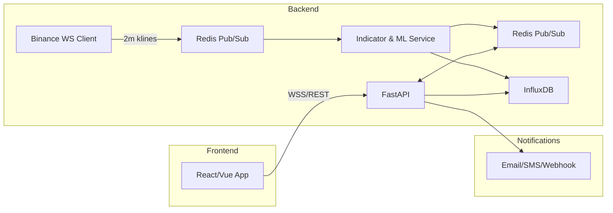

## Table of Contents
1. [Introduction](#1-introduction)
2. [Overall Description](#2-overall-description)
3. [Specific Requirements](#3-specific-requirements)
   - 3.1 [Functional Requirements](#31-functional-requirements)
   - 3.2 [Non-functional Requirements](#32-non-functional-requirements)
4. [External Interfaces](#4-external-interfaces)
5. [Data Requirements](#5-data-requirements)
6. [System Architecture Overview](#6-system-architecture-overview)
7. [Glossary](#7-glossary)

---

## 1. Introduction
### 1.1 Purpose
Define the requirements for a real-time crypto trading signal application that:
- Streams 2-minute OHLCV for BTCUSDT & ETHUSDT
- Generates “strong/weak buy/hold/sell” signals at ≥60% confidence
- Exposes REST & WebSocket APIs for frontend integration
- Sends push/email/webhook alerts

### 1.2 Scope
Covers backend data pipeline, signal logic, API layer, frontend UI, and notification subsystems. Excludes live order execution (paper-trading only).

### 1.3 Definitions & Acronyms
- **OHLCV**: Open/High/Low/Close/Volume
- **API**: Application Programming Interface
- **WS**: WebSocket
- **SMA/EMA/RSI**: Common technical indicators

---

## 2. Overall Description
### 2.1 Product Perspective
A standalone microservice-based app, with:
- **Backend**: Python/FastAPI + Redis + InfluxDB + ML models
- **Frontend**: React (or Vue) with Chart.js & WebSocket client

### 2.2 User Classes & Characteristics
- **Retail Traders**: need quick, actionable signals
- **Developers**: integrate signals into custom dashboards

### 2.3 Operating Environment
- **Server**: Linux VM or container (Docker)
- **Client**: Modern browsers (Chrome, Firefox) on desktop/mobile

### 2.4 Design & Implementation Constraints
- Must handle 2-min stream with <5 s end-to-end latency
- Use GitHub Copilot for scaffolding, but maintain code quality

---

## 3. Specific Requirements

### 3.1 Functional Requirements
| ID   | Feature                           | Description                                                                               |
|:----:|:----------------------------------|:------------------------------------------------------------------------------------------|
| FR-1 | Data Ingestion                    | Subscribe to Binance WS kline_2m for BTCUSDT & ETHUSDT, publish raw data to Redis Pub/Sub |
| FR-2 | Indicator Calculation             | Compute EMA(9/21), SMA, RSI(14) on each 2-min candle                                      |
| FR-3 | Forecast & Confidence             | Run ARIMA/LSTM to predict next-period Δprice + confidence score                           |
| FR-4 | Signal Grading                    | Map forecast & confidence to {strong/weak buy, hold, weak/strong sell}                   |
| FR-5 | REST API                          | GET `/latest-signal?symbol=` and GET `/history-signals?symbol=&limit=`                   |
| FR-6 | WebSocket Streaming               | Push `{symbol, timestamp, forecast_pct, confidence, category}`                           |
| FR-7 | Notifications                     | Send alerts via email/SMS/webhook when category ≠ “hold”                                 |
| FR-8 | Frontend Dashboard                | Display live chart with markers + chronological signal feed                             |
| FR-9 | User Settings                     | Allow symbol selection, confidence threshold slider, enable/disable weak signals         |
| FR-10| Backtesting (Phase 2)             | Replay historical data & evaluate signal performance metrics                            |

### 3.2 Non-functional Requirements
| Category          | Requirement                                                                                      |
|:------------------|:-------------------------------------------------------------------------------------------------|
| **Performance**   | <5 s latency from data arrival to front-end marker                                               |
| **Reliability**   | 99.9% uptime; automatic reconnection on WS drop                                                  |
| **Scalability**   | Modular services; easy to add new symbols or higher-frequency streams                            |
| **Security**      | HTTPS for all endpoints; store API keys/encryption creds in Vault or environment variables        |
| **Usability**     | Responsive UI; intuitive color-coded badges for signal categories                                 |
| **Maintainability**| Codebase linted/formatted (Black, ESLint); clear Copilot prompt registry; unit tests ≥80% coverage |

---

## 4. External Interfaces

### 4.1 User Interfaces  
- **Dashboard**: candlestick chart + signal feed + settings panel  
- **Mobile Alerts**: push notifications via Pushover or custom app

### 4.2 Hardware Interfaces  
- Standard server/VM; no specialized hardware needed

### 4.3 Software Interfaces  
- **Binance WS API** for market data  
- **Redis** Pub/Sub for messaging  
- **InfluxDB** for time-series storage  
- **SMTP/Twilio** for notifications

### 4.4 Communication Interfaces  
- REST over HTTPS (port 443)  
- WebSocket over WSS

---

## 5. Data Requirements
- **Data Retention**: store 2-min OHLCV + signals for ≥30 days  
- **Data Formats**: JSON for all API/WS payloads  
- **Backup**: daily snapshot of InfluxDB

---

## 6. System Architecture Overview

---

## 7. Glossary
- **Signal**: A recommendation (“buy”, “sell”, etc.) derived from model output  
- **Confidence**: Model’s certainty (0–100%) in its forecast  
- **2-min K-line**: Candlestick representing 2-minute OHLCV data

---

*Next Steps:* Review and refine this SRS, draft key Copilot prompts, and kick off Phase 1: Data ingestion & basic indicator signals.

---

## 8. Copilot Prompt Pack

**FR-1 Data Ingestion**  
“Generate a Python script using python-binance that subscribes to Binance's `kline_2m` WebSocket stream for BTCUSDT and ETHUSDT and publishes each candlestick JSON message to Redis Pub/Sub.”

**FR-2 Indicator Calculation**  
“Implement a Python function that consumes 2-minute OHLCV messages from Redis, computes EMA(9), EMA(21), SMA, and RSI(14) on the latest window, and publishes the indicator results back to Redis.”

**FR-3 Forecast & Confidence**  
“Scaffold a FastAPI endpoint `/forecast` that accepts a `symbol` parameter and returns the next-period ARIMA forecast percentage and a confidence score based on model output.”

**FR-4 Signal Grading**  
“Write a Python function `grade_signal(forecast_pct, confidence)` that categorizes inputs into 'strong buy', 'weak buy', 'hold', 'weak sell', and 'strong sell' based on defined thresholds.”

**FR-5 REST API**  
“Generate FastAPI routes for `GET /latest-signal?symbol={symbol}` and `GET /history-signals?symbol={symbol}&limit={limit}`, returning JSON payloads with symbol, timestamp, forecast_pct, confidence, and category.”

**FR-6 WebSocket Streaming**  
“Create a FastAPI WebSocket endpoint `/ws/signals` that streams `{symbol, timestamp, forecast_pct, confidence, category}` in real-time to connected clients.”

**FR-7 Notifications**  
“Implement a notification service in Python that listens on Redis Pub/Sub for signal messages and sends alerts via email, SMS, or webhook when category is not 'hold'.”

**FR-8 Frontend Dashboard**  
“Scaffold a React component named `SignalDashboard` that connects to `/ws/signals`, renders a 2-minute candlestick chart with Chart.js, and overlays signal markers with color-coded badges.”

**FR-9 User Settings**  
“Generate a React settings panel component to select symbols, adjust the confidence threshold via a slider, and toggle weak signals, saving preferences to local storage and sending updates to the backend.”

**FR-10 Backtesting**  
“Write a Python script using Backtrader that loads 2-minute OHLCV data from InfluxDB, replays signals based on `grade_signal`, and outputs performance metrics such as Sharpe ratio, max drawdown, and win rate.”

